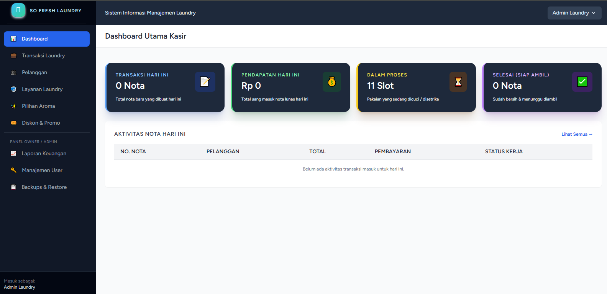
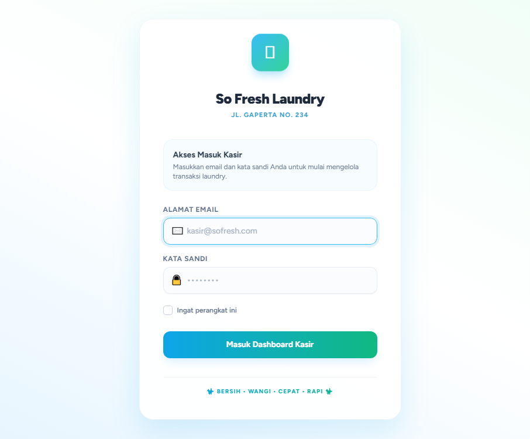
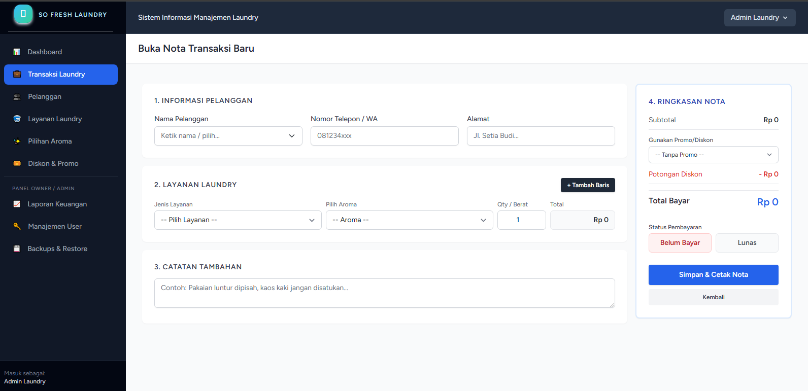

# Sistem Informasi Manajemen Laundry

Aplikasi sistem informasi berbasis web yang dirancang untuk mengelola operasional laundry secara efisien. Aplikasi ini telah diimplementasikan dalam lingkungan bisnis nyata dengan nilai jual Rp 3.500.000.

## 📸 Preview Aplikasi

| Dashboard                               | Login                           | Transaksi                               |
| :-------------------------------------- | :------------------------------ | :-------------------------------------- |
|  |  |  |

_(Pastikan Anda sudah memindahkan file gambar Anda ke folder `screenshots`)_

## ✨ Fitur Utama

- **Dashboard:** Ringkasan transaksi dan pendapatan harian.
- **Manajemen:** Pelanggan, Layanan (Kiloan/Satuan), dan Pilihan Aroma.
- **Transaksi:** Penomoran nota otomatis, diskon (nominal/persen), dan estimasi selesai.
- **Cetak Struk:** Mendukung printer thermal 58mm.
- **Laporan:** Analisis omzet bulanan & harian dengan fitur ekspor Excel/PDF.
- **Backup & Restore:** Keamanan data melalui sistem cadangan manual.

## 🛠️ Tech Stack

- **Framework:** Laravel 10.x
- **Frontend:** Tailwind CSS
- **Database:** MySQL
- **Environment:** Laragon 8.6.0

---

